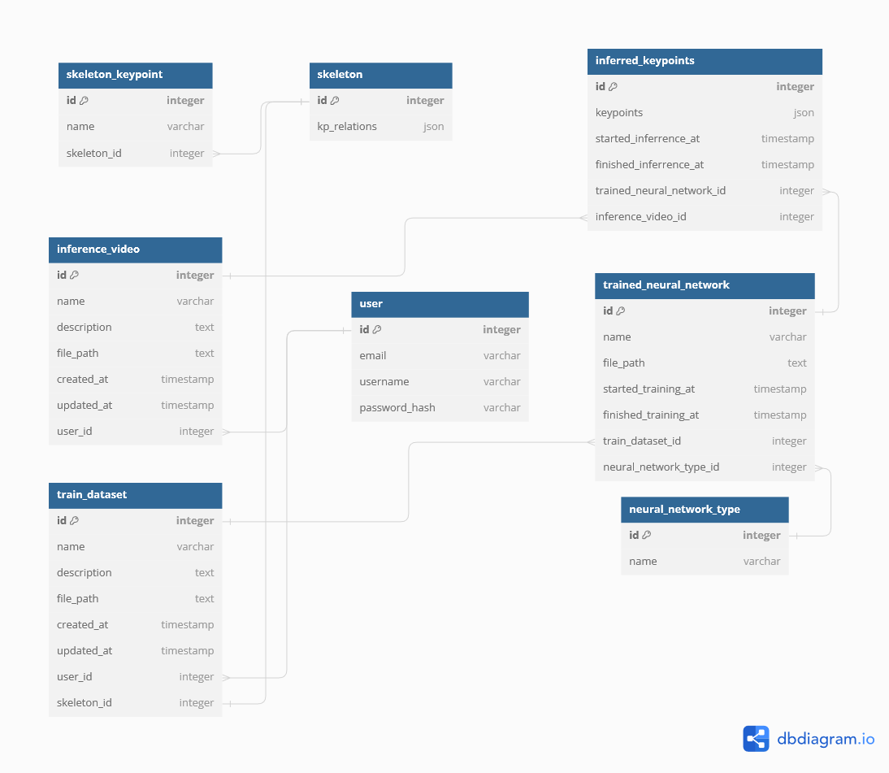

# Animal keypoint detection webapp

## Запуск приложения локально
Программный комплекс, частью которого является данное веб-приложение, состоит из основного (данного) 
веб-приложения и двух микросервисов: 
- <a href="https://github.com/HidenYT/dlc-microservice" target="_blank">Микросервис нейронной сети DeepLabCut</a>
- <a href="https://github.com/HidenYT/sleap-microservice" target="_blank">Микросервис нейронной сети SLEAP</a>

Микросервисы используются для работы нейронных сетей независимо от данного веб-приложения.

***ВАЖНО: Данное руководство расчитано на запуск всех трёх приложений на ОС Windows. В случае, если вы используете другую ОС, команды будут похожими, и вам будет необходимо проделать все те же шаги по аналогии с этим руководством.***

### Шаг №0 - Подготовка к установке
<details>
<summary>
Подробнее
</summary>
Необходимо склонировать себе на компьютер все 3 репозитория.

Все 3 веб-приложения работают на разных версиях Python, поэтому необходимо заранее установить на компьютер версии Python: 
- `3.11.2` - для основного веб-приложения (эта версия должна быть основной)
- `3.9.0` - для микросервиса DeepLabCut
- `3.7.9` - для микросервиса SLEAP

Все 3 веб-приложения используют СУБД PostgreSQL. Необходимо установить её к себе на компьютер и **заранее** создать по одной пустой базе данных для каждого веб-приложения. В данном руководстве будем считать, что СУБД будет иметь следующую конфигурацию:
- Хост - `localhost`
- Порт - `5432`
- Имя пользователя - `postgres`
- Название базы данных для основного веб-приложения - `animal_kp_detection_db`
- Название базы данных для микросервиса DeepLabCut - `dlc_db`
- Название базы данных для микросервиса SLEAP - `sleap_db`

Также все 3 веб-приложения используют Redis. По умолчанию предполагается, что он запущен на `localhost` на порте `6379`. Веб приложения используют базы данных Redis под номерами `0` - `2`. 
</details>

### Шаг №1 - Настройка основного веб-приложения
#### Шаг № 1.1 - Установка системы управления зависимостями Poetry
<details>
<summary>
Подробнее
</summary>

Для запуска основного веб-приложения потребуется версия Python 3.11.2.
Перейдите в каталог `src` в папке репозитория основного веб-приложения. **В этом каталоге** откройте консоль и напишите следующие команды, чтобы установить 
модуль управления зависимостями poetry и установить зависимости приложения:

```sh
pip install poetry
poetry install
```
Если версия Python `3.11.2` не является основной, то перед командой ```poetry install``` необходимо ввести команду ```poetry env use <Путь к Python 3.11.2 .exe>```, где `<Путь к Python 3.11.2 .exe>` - путь к файлу `python.exe` в папке Python 3.11.2.
</details>

#### Шаг № 1.2 - Установка переменных среды через `.env` файл
<details>
<summary>
Подробнее
</summary>

Создайте в каталоге `src` файл с названием `.env` и вставьте в него содержимое файла `.env.example`. 

В поле `SECRET_KEY`, если вы запускаете проект в целях тестирования, запишите любую строку. В противном случае вам необходимо сгенерировать секретный ключ и записать его туда.

В поля `DB_HOST`, `DB_PORT`, `DB_NAME`, `DB_USERNAME`, `DB_PASSWORD` необходимо вписать информацию о подключении к базе данных: хост, порт, название базы данных, имя пользователя и пароль. СУБД PostgreSQL на момент запуска веб-приложения должна быть запущена, и в ней должна быть создана пустая база данных с выбранным вами именем. 

Остальные поля можно оставить без изменений.
</details>

#### Шаг № 1.3 - Миграция базы данных
<details>
<summary>
Подробнее
</summary>

В командной строке в папке `src` выполните следующую команду 
```sh
poetry run python manage.py migrate
```
Теперь проект настроен и готов к запуску. 
</details>

#### Шаг № 1.4 - Запуск основного веб-приложения
<details>
<summary>
Подробнее
</summary>

Для запуска необходимо открыть ещё 2 командные строки **так же в каталоге `src`** и ввести в каждый по одной из команд ниже. Таким образом у вас должно быть открыто 3 терминала, в одном из которых запущено само приложение, в другом запущена очередь задач Celery, а в третьем - сервис Celery Beat.

```sh
poetry run python manage.py runserver
poetry run celery -A core.celery:app worker -l INFO -P threads
poetry run celery -A core.celery:app beat
```

После этого приложение станет доступно в браузере по адресу `http://127.0.0.1:8000/`
</details>

## Шаг №2 - Запуск микросервисов
<details>
<summary>
Подробнее
</summary>

Перейдите в папку репозитория (не в папку `src`) микросервиса DeepLabCut (для микросервиса SLEAP действия практически идентичны за исключением того, что необходимо использовать версию Python `3.7.9`). Откройте в этой папке командную строку и выполните следующую команду:
```sh
<Путь к python.exe файлу Python 3.9.0> -m venv venv
```
Эта команда создаёт виртуальную среду для Python в папке репозитория. Далее для активации виртуальной среды выполните команду
```sh
venv\Scripts\activate
```
Теперь перейдите в командной строке в папку `src` в папке репозитория микросервиса. Введите команду:
```sh
pip install -r -requirements.txt
```
Эта команда установит все необходимые приложению зависимости в виртуальную среду.

Далее аналогично установке основного веб-приложения, вам необходимо в папке `src` создать файл `.env`, вставить в него содержимое файла `.env.example` и изменить содержимое по мере необходимости (описание полей файла аналогично описанию в основном веб-приложении).

Далее выполните команду в папке `src` для миграции базы данных: 
```sh
flask db upgrade
```

Для DeepLabCut в папке `src` необходимо также создать папку uploads, куда добавить файл `dummy.mp4`. Это может быть абсолютно любое видео, желательно как можно более короткое. Этот шаг необходим, так как DeepLabCut требует использование хотя бы одного реального видео в проекте, даже если оно ни для чего не используется.

Теперь вы установили всё необходимое для запуска микросервиса. 

- Если вы пользуетесь ОС Windows и если виртуальная среда установлена в папке `venv` в папке репозитория микросервиса, то для вашего удобства в папке `src/bats` для обоих микросервисов были созданы файлы для быстрого запуска, вы можете запустить по очереди каждый из `.bat` файлов в `src/bats`, тем самым запустив микросервис.
- В противном случае (для запуска DeepLabCut) вам необходимо открыть 2 командные строки, активировать в них виртуальную среду и выполнить в каждой одну из команд в папке `src`:

```sh
flask run
celery -A app.run_celery:celery worker -l INFO -P threads
```

- В противном случае (для запуска SLEAP) вам необходимо открыть 3 командные строки, активировать в них виртуальную среду и выполнить в каждой одну из команд в папке `src`:
```sh
flask run --port 5001
celery -A app.run_celery:celery worker -l INFO -P threads
celery -A app.run_celery:celery beat
```
</details>


## Схема базы данных веб-приложения
<p align="center">

</p>